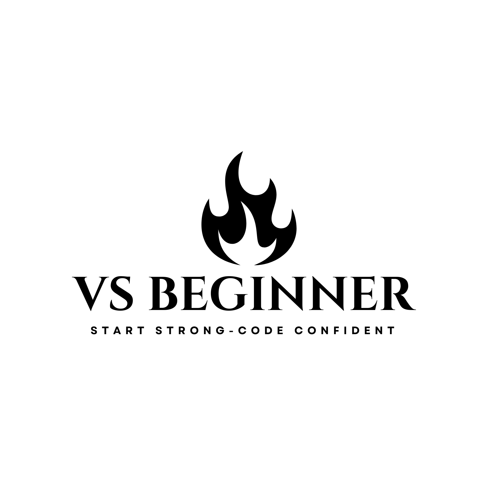

<p align="center">
  
</p>
# Python-Mastery
Learn Python from Basics to Advanced with Examples and Projects

A structured Python learning repository designed to help learners understand Python from **fundamental concepts to advanced topics** through explanations, examples, exercises, and practical projects.

This repository is organized as a **complete learning path** that gradually builds Python knowledge while encouraging hands-on coding practice using Jupyter notebooks.

---

# Overview

This repository provides a structured and practical approach to learning Python.
Each topic is explained through:

* Clear conceptual explanations
* Code examples
* Practice exercises
* Runnable Jupyter notebooks
* Mini projects

The goal is to create a **complete Python reference and learning resource** that helps learners develop strong Python programming skills.

---

# What we will learn?

By exploring this repository we will learn:

* Python Fundamentals
* Variables and Data Types
* Control Flow
* Functions and Recursion
* Python Data Structures
* Object Oriented Programming
* Advanced Python Concepts
* Python Libraries
* Real-world Python Projects

---

# Learning Roadmap

The repository follows a structured learning path.

Python Basics
↓
Control Flow
↓
Functions
↓
Data Structures
↓
Object-Oriented Programming
↓
Advanced Python
↓
Libraries
↓
Projects

---

# Repository Structure

```
python-mastery

README.md
LICENSE
.gitignore

01_python_basics
02_control_flow
03_functions
04_data_structures
05_oop
06_advanced_python
07_libraries
08_projects

assets
```

---

# Notebooks

All lessons are provided as **Jupyter notebooks**.

Each notebook includes:

* Concept explanation
* Code examples
* Exercises
* Solutions

The notebooks can be opened using **Jupyter Notebook or Google Colab**.

---

# How to Use This Repository

You can use this repository in the following ways:

1. Read the concept explanations.
2. Run the code examples.
3. Complete the exercises.
4. Explore the projects.

---

# Requirements
To run the notebooks locally we will need:

* Python 3.x
* Jupyter Notebook

---

# Contribution Policy

This repository is maintained by the author and is intended primarily as a personal learning resource.

---

https://img.shields.io/badge/Author-Vinayak Sharma-orange
# Author

Created and maintained by **Vinayak Sharma**

GitHub Profile:
https://github.com/vsbeginner

---

https://img.shields.io/badge/License-All%20Rights%20Reserved-red
# License

Copyright © 2026 Vinayak Sharma

All rights reserved.

This repository and its contents are the intellectual property of the author.
No part of this repository may be copied, modified, distributed, or reused without explicit permission from the author.

---

# Acknowledgements

This repository was created as a structured educational resource to support learning Python programming and to document the author's learning journey.
